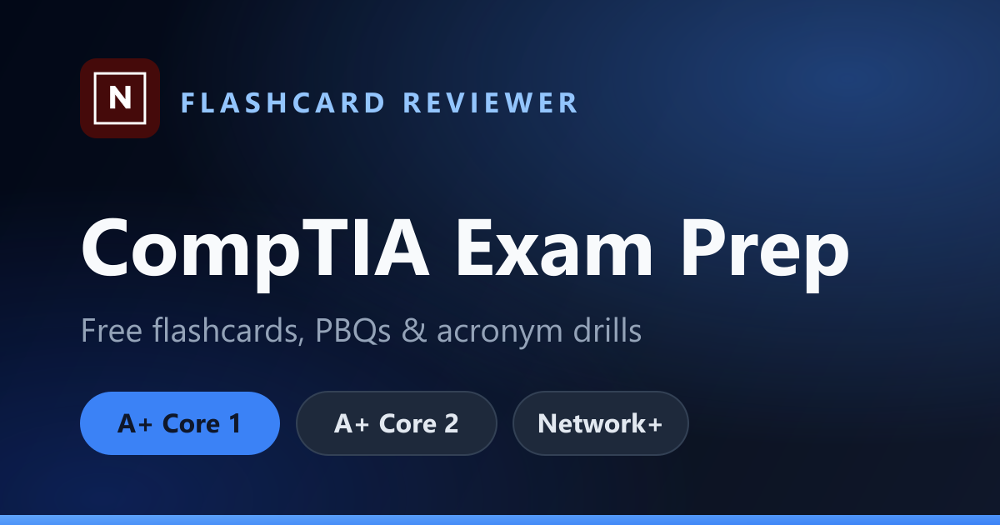

# CompTIA Reviewer

An interactive study platform for CompTIA certification exams — **A+ Core 1 (220-1201)**, **A+ Core 2 (220-1202)**, and **Network+ (N10-009)**, plus a **Security+ (SY0-701)** acronym track. Nine distinct study tools, one global exam toggle, all content served live from a Postgres database.

Built with **React 19**, **Vite 8**, and **Neon Postgres**, deployed on **GitHub Pages**.

[](https://react.dev/)
[](https://vite.dev/)
[](https://tailwindcss.com/)
[](https://neon.tech/)

**▶ Live demo:** https://akosinoan.github.io/comptia_reviewer_flashcard/



---

## Why this project is worth a look

This is not a tutorial to-do app. It's a real, content-heavy study tool with non-trivial domain logic — a from-scratch subnetting engine, a drag-and-drop RAID validator, generic performance-based-question (PBQ) components reused across two feature areas, and a clean service layer that lets the browser talk to Postgres directly with **no custom API server to maintain**.

If you're evaluating frontend work, the things to skim for: **state architecture** (single global context drives the whole app), **component reuse** (the same three PBQ components power 30+ exercises across two feature areas), **separation of concerns** (every data call lives behind a service module, never in a component), and **pure-CSS interaction design** (3D flip cards, native HTML5 drag-and-drop — zero animation/DnD libraries).

---

## Features

A global `ExamContext` provider exposes the active exam (`core1` | `core2` | `netplus`); every section re-fetches and re-renders for that exam automatically.

| Section | Description |
|---|---|
| **Flashcards** | Flip-card study mode with category filtering, shuffle, and exam-aware question sets |
| **Port Matching** | Click-to-match and quiz modes with real-time accuracy tracking |
| **Acronyms** | Searchable, categorized list with rich detail panels, collapsible subcategories, and a Security+ track (incl. Network+ "confusion-trap" comparison cards and decision-rule cheat-sheets) |
| **RAID Simulator** | Drag-and-drop drive placement across scenarios with instant, full-configuration validation |
| **PBQ Exercises** | Three interactive question types — drag-to-bucket, click-to-match, and drag-to-order |
| **PC Builder** | Scenario-based hardware selection with scoring and per-choice explanations |
| **CLI Commands** | Searchable Windows/Linux command reference organized by category |
| **Subnetting** | IPv4 practice with 3 difficulty levels, multiple question types, and step-by-step bit-level walkthroughs |
| **OSI Model Drills** | 9 interactive exercises covering protocols, PDUs, devices, security controls, and troubleshooting |

---

## Tech Stack

### Frontend
- **React 19** — functional components and hooks throughout; no class components
- **Vite 8** — sub-second HMR, path aliases (`@/`), optimized production builds
- **React Router v7** — client-side routing with `base` configured for GitHub Pages subpath hosting
- **Tailwind CSS 3** — utility-first styling with HSL CSS variables for light/dark theming
- **Radix UI** — accessible, unstyled primitives (Dialog, Progress, Slot)
- **Lucide React** — consistent icon set
- **CVA + clsx + tailwind-merge** — conflict-free component variant system (`cn` helper)

### Data
- **Neon (serverless Postgres)** — all study content (questions, acronyms, ports, commands, PBQs, RAID/PC-builder scenarios) lives in Postgres and is fetched on demand
- **`@neondatabase/serverless`** — the browser queries Postgres directly over HTTP using a **read-only `web_anon` role** (`SELECT`-only privileges), so there is no API tier to build, host, or secure separately
- **Single `exam` column** scopes every content table to one of the three exams — one schema covers all of them
- **JSONB columns** for variable-shape data (PBQ payloads, RAID drive arrays, Win/Linux command pairs, Network+ comparison cards)
- **Idempotent seed script** — `scripts/seed.mjs` migrates the static JS datasets into Postgres via `INSERT … ON CONFLICT DO UPDATE`, safe to re-run

### Tooling & Deployment
- **pnpm** — fast, disk-efficient package manager
- **ESLint 9** — flat config with React hooks and refresh plugins
- **GitHub Pages** — static SPA deploy with a `404.html` redirect shim for client-side routing

---

## Architecture

### Global exam context
One `ExamContext` provider wraps the app and exposes the active exam mode. Every data service, hook, and page reads from it — flip one toggle, and the entire app re-fetches and re-renders for that exam. The selection persists to `localStorage`.

### Service layer
Every database call lives in `src/services/`, never in a component. Each service returns data in the exact shape the UI expects (camelCase field names, JSONB payloads rehydrated to flat objects), so the data source can change without touching a single component — exactly what happened when this project migrated its backend with no UI churn.

```
src/services/
  neonClient.js         ← singleton Neon SQL client (sql`…` tagged template)
  questionsService.js
  acronymsService.js    ← merges DB acronyms with Network+ traps/rules + Security+ set
  portsService.js
  commandsService.js
  pbqService.js         ← rehydrates JSONB payloads for bucket/match/order types
  raidService.js        ← snake_case → camelCase mapping
  pcBuilderService.js
```

### Reusable fetch hook
`useAsyncQuery(fetchFn, deps)` handles loading, error, and data states for every async fetch, with an abort-ref guard that discards stale results when the exam switches mid-request.

```js
const { data, loading, error } = useAsyncQuery(() => getQuestions(exam), [exam]);
```

### Component hierarchy
```
src/
  pages/            ← route-level components; own their data-fetching and page state (10 pages)
  components/
    shared/         ← PageHeader, PageNav, SearchInput, CategoryPills,
                      ExplanationPanel, ResultBanner, LoadingSpinner
    ui/             ← Button, Badge, Progress (Radix + Tailwind wrappers)
    pbq/            ← BucketPBQ, MatchPBQ, OrderPBQ — shared by the PBQ page AND the OSI module
    raid/           ← DriveCard, RAIDDiagram, raidUtils
    subnet/         ← SubnetVisual, SubnetSolution, SubnetCheatSheet, DifficultySelector
    ports/          ← PortMatchingGrid, PortQuizTable
  hooks/            ← useAsyncQuery, useStudyCards, usePortMatching, useAcronyms, useCommandFilter
  utils/            ← shuffle, subnetGenerator
  lib/              ← cn (class-name merge)
```

---

## Engineering highlights

**Subnetting engine** — pure 32-bit integer bitwise arithmetic computes network address, broadcast, host range, and host count for any CIDR. Generates randomized private-range IPv4 questions across three difficulty tiers, each with a binary, bit-level visual walkthrough. No IP library.

**Drag-and-drop RAID simulator** — the native HTML5 drag API with swap-within-bays, drag-back-to-pool, and per-bay visual feedback. The whole configuration (correct RAID level *and* correct drives in every bay) validates as a single derived boolean.

**PBQ component reuse** — `BucketPBQ`, `MatchPBQ`, and `OrderPBQ` are generic enough to power both the standalone PBQ page and the 9-exercise OSI module with zero per-feature modification.

**JSONB payload rehydration** — PBQ exercises store type-specific fields (`buckets`+`items`, `left`+`right`, or `items`) in one JSONB column. The service layer spreads each payload back into the flat shape components expect, so the DB schema and the UI can evolve independently.

**Pure-CSS 3D flip cards** — flashcards use `transform-style: preserve-3d` and `rotateY(180deg)` with a 0.6 s ease transition. No animation library.

**Theme system** — light/dark preference is detected from `prefers-color-scheme` on first load, toggled via a class on `<html>`, and persisted to `localStorage`. Every color is an HSL CSS variable, so the full palette switches with one class change.

**Direct browser-to-Postgres data path** — using Neon's serverless HTTP driver with a `SELECT`-only database role removes an entire API tier from the stack while keeping writes impossible from the client.

---

## Local development

```bash
# Install dependencies
pnpm install

# Create .env.local with your Neon connection string
#   VITE_DATABASE_URL=postgres://web_anon:...   (read-only role for the browser)
#   DATABASE_URL_ADMIN=postgres://owner:...      (schema owner, only for seeding)

pnpm dev        # start the Vite dev server with HMR
pnpm build      # production build to /dist
pnpm preview    # preview the production build locally
pnpm lint       # run ESLint
```

### Seeding the database (one-time)

```bash
# Run the rich-schema DDL once on a fresh Neon project, then seed:
#   psql "$DATABASE_URL_ADMIN" -f scripts/schema_rich.sql
node --env-file=.env.local scripts/seed.mjs
```

---

## Project structure

```
comptia_reviewer_flashcard/
├── public/               # favicon, OG image, 404 redirect shim, sitemap, robots
├── src/
│   ├── components/        # Shared + feature-specific UI components
│   ├── context/           # ExamContext (global exam mode)
│   ├── data/              # Remaining static config (subnetData, raidCore1, Security+ acronyms)
│   ├── hooks/             # useAsyncQuery + feature hooks
│   ├── lib/               # cn class-name helper
│   ├── pages/             # One file per route (10 pages)
│   ├── services/          # Neon data-access functions
│   └── utils/             # shuffle, subnetGenerator
├── scripts/
│   ├── seed.mjs           # Idempotent data migration to Neon
│   ├── schema_rich.sql    # DDL for rich acronym detail + trap/rule tables
│   └── og-image.svg       # Source for the social-share preview image
└── vite.config.js
```

---

## License

Personal project, built for study and as a portfolio piece. Feel free to explore the code.
```
